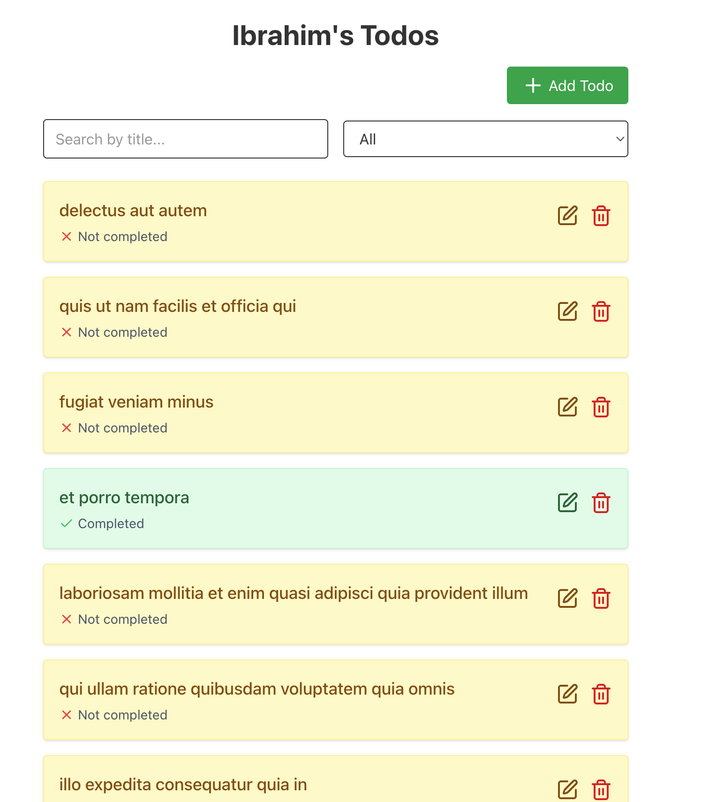

# React Todo App

A comprehensive Todo application built with React, demonstrating API integration, routing, form handling, and accessibility best practices.

## 🔧 Features

- ✅ View list of todos with client-side pagination
- 🔍 Search todos by title
- 🧩 Filter todos by completion status (All / Completed / Incomplete)
- ➕ Add new todo items
- 🖊️ Edit existing todos via modal popup
- ❌ Delete todos with confirmation modal
- 🔁 Real-time API interaction with [JSONPlaceholder](https://jsonplaceholder.typicode.com/)
- 🔐 Error boundaries and custom 404 page
- 📱 Fully responsive and accessible interface

## 📸 Screenshots

 <!-- replace with actual path -->
> *Add a few screenshots or GIFs showing key features like Add, Edit, Delete, and Search*

---

## 🚀 Live Demo

🔗 [View the app live on Vercel/Netlify](https://jelly-todo.netlify.app/)

---

## 🛠️ Tech Stack

| Technology        | Purpose                           |
|-------------------|-----------------------------------|
| React 19          | UI rendering                      |
| Vite              | Project bundler                   |
| Tailwind CSS      | Styling                           |
| React Router DOM  | Client-side routing               |
| Axios             | HTTP requests                     |
| TanStack Query    | API data fetching and caching     |
| Lucide React      | Icons                             |

---

## 🧭 Project Structure

```plaintext
todo-app/
├── public/
│   └── index.html
├── src/
│   ├── api/
│   │   └── todos.js
│   ├── components/
│   │   ├── TodoForm.jsx
│   │   ├── DeleteModal.jsx
│   │   ├── EditModal.jsx
│   │   └── ErrorBoundary.jsx
│   ├── pages/
│   │   ├── TodoListPage.jsx
│   │   ├── TodoDetailPage.jsx
│   │   └── NotFoundPage.jsx
│   ├── utils/
│   │   └── localCache.js
│   ├── App.jsx
│   ├── main.jsx
│   └── index.css
├── .gitignore
├── package.json
├── README.md
└── vite.config.js

---

## 🧪 Available Scripts

```bash
# Start development server
npm run dev

# Build for production
npm run build

# Preview built site locally
npm run preview

